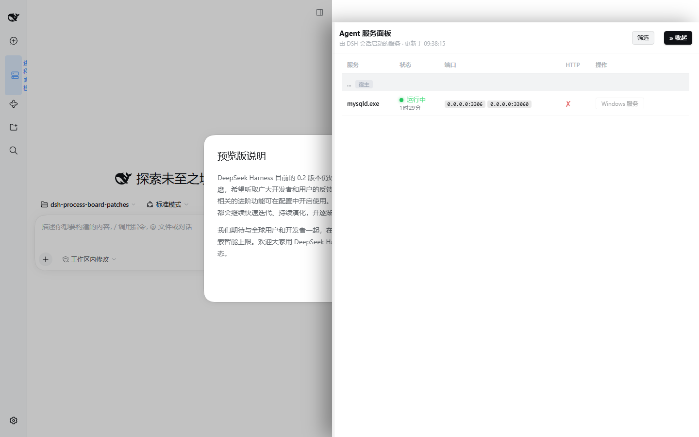
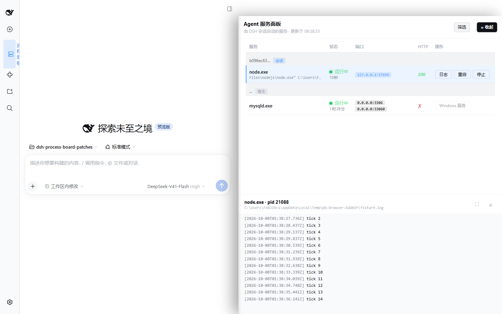

# dsh-service-board

DSH（DeepSeek Harness）服务面板插件——在 Web GUI 侧边栏查看**由哪个对话（Agent 会话）启动了哪些服务**：按会话分组、三态健康探测 + HTTP 码、每个进程的启动时间与运行时长、礼貌停止、实时日志分栏、原地重启并重放原命令行。

**English**: A docked DSH service panel — see which conversation (agent session) started which service, with start time and uptime, tri-state health, live log tail and restart replay. Zero runtime dependencies, pure-DOM client.

> **本包是 [dsh-process-board](https://github.com/cyanTao/dsh-process-board) 的补丁分叉（fork），不是原项目。**
> 上游 0.2.2 的作者是 mr-liangjx（MIT，原版权声明保留在 [LICENSE](LICENSE)）。本分叉修掉了
> 三个真实缺陷（重启后日志变「日志不可用：no-log」、扫描器把同名启动器与同名服务当
> master/worker 合并从而丢掉真服务、面板用原生对话框抢走输入框焦点）并补上了停靠式面板、
> 运行时长、日志带等改造。逐条差异见 [CHANGELOG.md](CHANGELOG.md)，工程记录（症状→实测原因→
> 修复→验证）见 [docs/patches.md](docs/patches.md)。上游项目依旧可用，装哪个都行。

## 效果预览

**服务面板**——停靠在右侧，按会话分组，一行一服务：状态 + 运行时长、端口徽章（带绑定地址）、HTTP 码、PID、日志/重启/停止：



**日志带**——选中服务后列表下方展开实时日志（ERROR 红 / WARN 黄、时间戳弱化、4 秒自动刷新、滚动吸底），可全屏；重启后日志带自动跟到新 pid 继续读：



## 与上游 0.2.2 的差异

| 类型 | 内容 | 实测证据 |
|---|---|---|
| 修复 | **重启后日志不再变「日志不可用：no-log」**：`/start` 现在等一次扫描看到新进程才回包（`/log` 是按「最近一次完成的扫描」查 pid 的） | `test/actions.test.mjs`：重启一个真进程后立刻 `POST /log`，必须拿到它自己写的第一行输出 |
| 修复 | **扫描器不再丢服务**：master/worker 合并（nginx 规则）原先只按进程名判断，于是「同名启动器 → 同名服务」会把真服务当 worker 删掉（实测：子进程从扫描结果消失、端口算到父进程、`/log` 返回 no-log）。现在要求命令行一致且非空，且带日志标记的后代绝不合并 | `test/scanner-merge.mjs`（7 种进程表形态）；`test/actions.test.mjs` 断言该 pid 仍在 `/state` 里 |
| 修复 | **日志带跟服务，不跟 pid**：重启后自动改跟同名同端口的新进程；服务真的停了会说「进程已结束或正在重启（pid …）」而不是抛 `no-log` | `test/client-dom.test.mjs`（7300 → 7400 的迁移）；`test/browser-check.mjs` 真机重启 |
| 修复 | **不再抢输入框焦点**：停止/重启的确认、以及所有报错，都改在面板内显示（原先用 `window.confirm` / `window.alert`，在桌面端是窗口级模态，关掉后焦点回到窗口而不是 composer） | `test/client-dom.test.mjs` 断言 `window.confirm`/`window.alert` 从未被调用；`test/browser-check.mjs` 在真实页面里量 composer 是否还能落字 |
| 修复 | **日志配色用了不存在的主题 token**：浅色主题下日志正文对比度只有 1.07:1（几乎看不见）。改用真实存在的 `--dsw-alias-*` 组合 | `test/panel-css.test.mjs` 对照真实主题表（0 个悬空 token）；`test/log-band.mjs` 量到 18.08:1 |
| 新增 | **每行显示运行时长**（如 `3时12分`），精确启动时间在元素的 `title` 里；扫描器的启动时间取整方式也修正了（原先四舍五入慢 1 秒） | `test/client-dom.test.mjs`；`test/probe-scanner.mjs` 与 WMI 独立比对 |
| 新增 | **停靠式面板**：不再用居中模态遮住界面，而是占住右侧、App 内容滑动让位；宽度可拖拽（300–1000px，方向键也行）并记忆到配置；窄宽度下按容器查询依次收起 HTTP、PID 列 | `test/panel-css.test.mjs`、`test/verify-resize.mjs`、`test/browser-check.mjs` |
| 新增 | **筛选**：`scope`（全部 / 仅会话启动）、`ports` 白名单、`hide` 关键字，写在 `~/.dsh/gate/process-board/config.json`，改完下次扫描即生效 | `test/config.test.mjs` |
| 新增 | **关面板归还键盘焦点**给打开面板前的元素（而不是把焦点丢在随后被隐藏的按钮上） | `test/browser-check.mjs` |

> 想自己跑这些证据：见下方「测试」。14 条自检，其中 5 条会起真进程或开真浏览器。

## 安装

> 前置：已安装 DSH（`dsh` 命令可用）。`dsh plugin` 底层是 pnpm，以下任一方式均可。

```bash
# 方式 A（推荐）：npm 安装——版本语义化，升级方便
dsh plugin --profile web add dsh-service-board

# 方式 B：git 仓库直装（锁定分支最新提交）
dsh plugin --profile web add https://github.com/fanjinduo111/dsh-service-board.git

# 方式 C：clone 后本地链接（可改代码、随改随生效）
git clone https://github.com/fanjinduo111/dsh-service-board.git ~/dsh-service-board
dsh plugin --profile web add link:~/dsh-service-board
```

升级 / 卸载：

```bash
dsh plugin --profile web update dsh-service-board
dsh plugin --profile web remove dsh-service-board
```

安装后**重启 DSH 宿主**（重新 `dsh web`），浏览器刷新页面 → 侧边栏出现「进程面板」入口。

> ⚠️ `link:` 只接受**本地目录路径**；写 `link:https://...` 会被当本地路径解析失败。

> ⚠️ 与上游**同时安装会插入两行侧边栏入口**（两个包各自注册自己的插件行）。只装一个。

## 使用

侧边栏「进程面板」→ 右侧停靠面板：

- **日志**：列表下方展开实时 tail（仅对带 `DSH_PB_LOG` 标记的进程可用）；`⛶` 可让日志铺满整个面板
- **重启**：先在面板内确认（确认框里会显示即将重放的原命令行），然后停止进程树 → 按原命令行以 detached 方式重启 → 注入日志标记。**重启会等一次进程扫描（约 1–3 秒）才刷新**，所以点完按钮会有短暂「执行中…」，这是有意的：宿主在等新进程进入扫描结果，否则紧接着点「日志」就会看到 no-log
- **停止**：面板内确认后礼貌终止（SIGTERM/taskkill → 10 秒宽限 → 进程树强杀）。Windows 服务（SCM 托管的，如 MySQL）显示「Windows 服务」而不是停止按钮，因为它会被 SCM 立刻拉起
- **筛选**：选择监控范围、端口白名单与隐藏关键字
- **Esc** 逐级退出：日志全屏 → 面板全屏 → 收起面板

### 让面板「看得见」你起的服务

面板通过两个环境标记识别服务：`DSH_PB_LOG`（该进程的日志文件，`/log` 只允许读它，防任意文件读取）和 `DSH_SESSION_ID`（归属到哪个对话，Windows 经 PEB 环境块读取）。

```bash
# Windows PowerShell：带标记启动，面板即可见、可停、可看日志、可重启
$env:DSH_PB_LOG = "$env:TEMP\my-service.log"
Start-Process java -ArgumentList '-jar','app.jar' -RedirectStandardOutput $env:DSH_PB_LOG -WindowStyle Hidden
```

```powershell
# 或直接登记并启动（之后面板「启动」按钮可重放）
curl -X POST http://127.0.0.1:3080/api/plugins/process-board/start `
  -H 'content-type: application/json' `
  -d '{"name":"my-svc","argv":["java","-jar","app.jar"],"cwd":"D:/app","port":8080,"logFile":"C:/tmp/my-svc.log"}'
```

## 权限与风险（请先读这一段）

这个插件的功能就是「看进程、杀进程、起进程」，所以它确实需要这些能力，装之前请确认你接受：

| 能力 | 说明 | 边界 |
|---|---|---|
| 读取进程信息 | 每个扫描周期（10 秒）调用一次 `powershell.exe`，用 WMI 取进程列表/命令行/启动时间/监听端口，并读候选进程的**环境块**（Windows PEB）找 `DSH_SESSION_ID` / `DSH_PB_LOG` | 只读；不写进程内存 |
| 终止进程 | 「停止/重启」会对目标进程**整棵树**先礼貌终止、再强杀 | 需要你在面板里点按钮并二次确认（确认框在面板内） |
| 启动进程 | 「启动/重启」以 detached 方式、按登记/扫描到的命令行启动，stdout/stderr 合流到日志文件 | 只重放你确认过的命令行 |
| 本地 HTTP 路由 | 在 DSH 自带 web server 上挂 `/state` `/config` `/kill` `/log` `/start` | 只监听 loopback，并要求浏览器同源标记（`Sec-Fetch-Site`）+ 校验 `Host`/`Origin`，防 CSRF/DNS rebinding；`/log` 仅允许 `DSH_PB_LOG` 标记过的路径 |
| 落盘 | `~/.dsh/gate/process-board/config.json`（筛选）与 `services.json`（登记表，含命令行） | 纯本地 |

风险自评：这是**面向本机开发者的工具**，不是多租户服务；它假定运行 DSH 的这台机器和这些进程都是你自己的。若你在共享机器上跑 DSH，请只装你信任的插件。

## 平台支持

| 层 | Windows | macOS / Linux |
|---|---|---|
| 面板 UI / API / 筛选 / 登记表 | ✅ | ✅ |
| 端口与 HTTP 探测、礼貌停止 | ✅ | ✅（POSIX 信号 + 进程组） |
| **进程扫描 + 会话归属（PEB 环境块）** | ✅（WMI + PEB） | 🚧 **未实现**：`src/host/scanner.js` 在非 win32 上直接返回空数组 |

> **诚实说明：目前只有 Windows 上有数据。** macOS / Linux 上插件能加载、面板能打开，但列表是空的（扫描器明确返回 `[]`）。要支持 POSIX 需要补一个扫描器（`ps` + `lsof -i` + 读 `/proc/<pid>/environ`，其实比 Windows 的 PEB 简单）——欢迎 PR。

## API

所有路由都在 DSH web server 的 `/api/plugins/process-board/` 下，loopback + 同源标记防护：

| 路由 | 方法 | 入参 | 说明 |
|---|---|---|---|
| `/state` | GET | — | 扫描快照 + 逐服务三态探测 + HTTP 码 + `created`（FILETIME 秒）+ `logPath` |
| `/config` | GET / POST | `{scope?, ports?, hide?, width?}` | 读/写筛选与面板宽度（局部合并，写入前校验） |
| `/kill` | POST | `{pid}` | 礼貌停止进程树；**回包前会等一次扫描收敛**，所以回包即最终态 |
| `/log` | POST | `{pid, lines?}` | tail 日志（≤500 行；只读 `DSH_PB_LOG` 标记的路径） |
| `/start` | POST | `{name}` 或 `{name, argv, cwd, port, logFile}` | 重放登记或显式启动；**同样等扫描看到新进程才回包**（0.3.0 起） |

## 结构

```
src/host/            # 宿主侧（DSH host 进程内，node ESM，零运行时依赖）
  scanner.js         #   进程扫描：WMI + PEB 环境块读标记 + 三道服务过滤（含 master/worker 合并）
  probe.js           #   三态探测（端口/HTTP/pid）+ 礼貌停止
  registry.js        #   服务登记表 ~/.dsh/gate/process-board/services.json（mkd 锁 + 原子写）
  config.js          #   筛选配置读写与校验
  index.js           #   路由 state/config/kill/log/start + 周期扫描
src/client/index.js  #   浏览器侧：侧边栏入口 + 停靠面板 + 日志带（纯 DOM，零 React）
cordis.patch.yml     #   把插件行插进 web profile 的插件清单
docs/patches.md      #   工程记录：每个缺陷的症状→实测原因→修复→验证
scripts/             #   打包用：build-package.mjs（绕开 src junction）、set-identity.mjs（填发布身份）
test/                #   14 条自检（真进程 / 真浏览器 / jsdom / 负向对照）
```

## 测试

```bash
npm install                                   # 只装测试用的 jsdom / puppeteer-core
node test/package-identity.test.mjs # 打包不变量：客户端模块 id = 包名、files 带 src、patch 指对文件
node test/actions.test.mjs        # /kill 与 /start 打在真实子进程上
node test/restart-path.mjs        # 扫描→停止→按 argv 重放→再扫描
node test/scanner-merge.mjs       # master/worker 合并规则（7 种进程表）
node test/client-dom.test.mjs     # 用 jsdom 驱动真正发布的客户端 bundle
node test/log-band.mjs            # 日志带在真 Chromium 里的布局/配色/对比度
node test/config.test.mjs         # 筛选：HTTP、落盘、手改、损坏文件
node test/guard.test.mjs          # 请求防护的每个放行/拒绝分支
node test/http.test.mjs           # 同样的判定，走真 socket
node test/panel-css.test.mjs      # 停靠面板样式表结构 + 主题 token 是否真实存在
node test/panel-css-control.mjs   # 负向对照：这些规则在上游包里不存在
node test/cmdline.test.mjs        # Windows 命令行切分
node test/probe-scanner.mjs       # 真实扫描器 vs WMI 独立比对
node test/browser-check.mjs <url> # 真实例：面板、输入框焦点、真重启+日志
```

`browser-check.mjs` 需要一个**非桌面端独占**的 profile：

```bash
dsh --profile <profile> --port 19410 --no-open
node test/browser-check.mjs "http://127.0.0.1:19410/?token=<控制台打印的 token>"
```

## 打包 / 发布

发布者请看 [PUBLISHING.md](PUBLISHING.md)（身份、建仓、npm、市场提交、逐条核对）。两个坑值得
所有 fork 的人知道，都是打包实测才暴露的：

1. **客户端模块 id 必须等于 npm 包名。** 宿主按包名生成客户端 boot graph 的 row id，并据此查找
   模块；不一致时装载器在共享 batch 里找不到该 row，就回落到本包自己的 one-resource URL 再执行
   一次脚本，报 `client-modules: duplicate factory registration`，**侧边栏入口根本不出现**。
   本仓库第一次 `npm pack` 就是这样：包名改成 `dsh-service-board`、`id` 还是 `dsh-process-board`。
   `test/package-identity.test.mjs` 守着这条（反向对照：改回去必须 FAIL），`scripts/set-identity.mjs`
   改名时会一并改它。
2. **`npm pack` 不跟随本工作区的 `src/` junction**：打出的包里一个源码文件都没有，装上去是
   「装得上、什么都不做」的空插件。所以走 `node scripts/build-package.mjs --pack`（先复制成真文件
   再打包），`git clone` 出来的仓库则没有这个问题。

## License

MIT，含上游 [dsh-process-board](https://github.com/cyanTao/dsh-process-board) 的版权声明，见 [LICENSE](LICENSE)。
